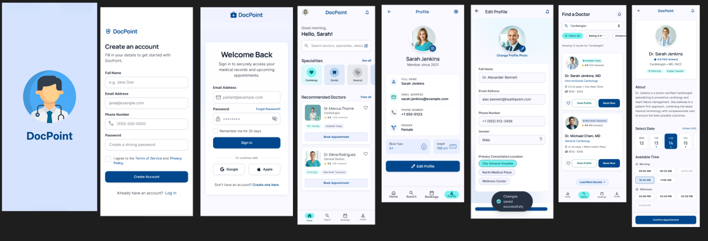

# 🏥 Doctor Appoinment
> A cross-platform healthcare appointment booking system built with Flutter, delivering seamless experience across iOS, Android, and Web.


## 📱 Screenshots

| Home | Book Appointment | Profile |
|------|------------------|---------|
|  |  |  |

## ✨ Features

- ✅ **Multi-Role Auth**: Patient and Doctor roles with Firebase Authentication
- ✅ **Appointment Booking**: Real-time scheduling with conflict detection
- ✅ **Cross-Platform**: Single codebase for iOS, Android, and Web
- ✅ **Responsive Design**: Adapts to phones, tablets, and desktop browsers
- ✅ **Doctor Profiles**: Browse doctors by specialty, rating, and availability
- ✅ **Material Design 3**: Modern, accessible UI following latest guidelines

## 🔧 Tech Stack

| Category | Technology |
|----------|-----------|
| **Framework** | Flutter 3.x (iOS, Android, Web) |
| **Auth** | Firebase Authentication |
| **Database** | Firebase Firestore |
| **State Management** | BLoC / Cubit |
| **Design** | Material Design 3, Responsive Layouts |

## 🏃 Getting Started

```bash
git clone https://github.com/asherifo/medbook.git
cd medbook
flutter pub get
flutter run
